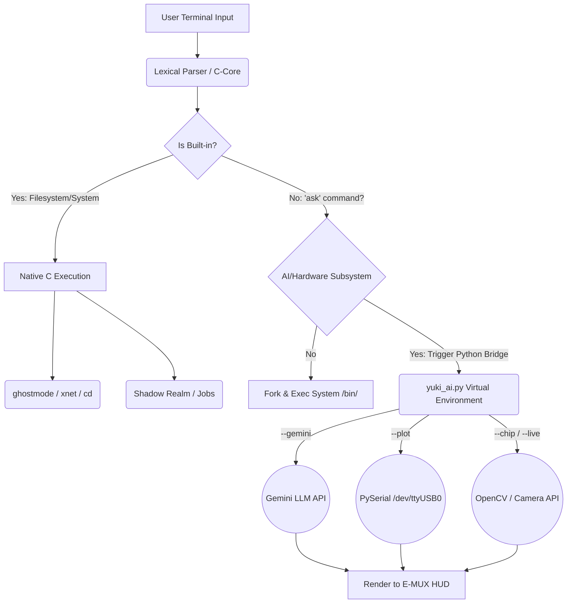

# 🌌 YukiShell | Aegis-Edge Core (V26c)


**YukiShell** is a high-performance, custom C-based Linux shell environment engineered specifically for Electronics and Communication Engineering (ECE) workflows, embedded systems development, and AI-assisted terminal operations. 

Developed by **Yukino Labs**, it bridges the gap between low-level system execution, bare-metal hardware telemetry, and cloud-based AI multi-modal inference.

---

## 📸 System Showcase

### Neural Link (AI Engine Integration)
*Real-time AI querying directly from the command line using the `--gemini` flag.*


### Ghostmode (Ephemeral Namespace Container)
*Root-level system override initiating an isolated, RAM-only `/tmp` container environment.*


---

## 🎯 Who is this for?
YukiShell is designed for:
* **Embedded Engineers:** Needing fast, scriptable access to serial ports, I2C buses, and hardware telemetry without leaving the terminal.
* **ECE Students & Researchers:** Requiring quick datasheet lookups, pinout diagrams, and AI assistance for complex C/C++ or FreeRTOS implementations.
* **Power Users:** Linux enthusiasts looking for a highly customizable shell with built-in ephemeral containers (`ghostmode`) and background process management.

---

## ✨ What's Unique?
* **Ghostmode:** Instantly spin up an ephemeral namespace container. All files written inside the vortex vanish upon exit.
* **Yuki Oscilloscope (`--plot`):** Real-time, ANSI-rendered hardware graphing for serial telemetry streams (e.g., `/dev/ttyUSB0`) directly in the shell.
* **Silicon Scanner (`--chip`):** Computer Vision integration via webcam to scan physical ICs/Microchips and instantly retrieve ASCII pinouts and datasheets.
* **Sentinel Engine:** Lightning-fast, asynchronous local network port scanning (`xnet`).

---

## 🚀 What's New in V26c (Aegis-Edge)
* **Refactored Shadow Realm:** Enhanced background process PID tracking (`jobs`, `&`).
* **Baud Rate Synchronization:** Fixed serial mismatch bugs for native 9600/115200 hardware telemetry.
* **Modular C-Core:** Fully decoupled `src/` architecture (`builtins.c`, `parser.c`, `yql.c`).
* **Visual Tutor Agent:** Real-time continuous video stream analysis via `--live`.

---

## 🏗️ System Architecture & Workflow

*(The diagram below maps the execution flow of YukiShell. On compatible markdown viewers, this diagram is zoomable/movable).*



---

## ⚙️ Installation & Setup

### Prerequisites
Ensure your Linux environment has the core build tools and Python 3 installed.
```bash
sudo apt update
sudo apt install build-essential libreadline-dev python3 python3-venv python3-pip
```

### 1. Clone the Repository
```bash
git clone [https://github.com/yourusername/Yukishell.git](https://github.com/yourusername/Yukishell.git)
cd Yukishell
```

### 2. Setup the Python Virtual Environment (For AI/Hardware Bridge)
```bash
python3 -m venv venv
source venv/bin/activate
pip install google-generativeai opencv-python pyserial
```

### 3. Add API Keys
Create a `.env` file in the root directory to link the AI brain:
```env
GEMINI_API_KEY=your_google_gemini_key_here
```

### 4. Compile the Aegis-Edge Core
```bash
gcc src/*.c -Iinclude -o yukishell -lreadline
```

### 5. Launch
```bash
./yukishell
```

---

## 📖 Core Command Manifest

| Command | Category | Description |
| :--- | :--- | :--- |
| **`xls`** / **`xcat`** | Filesystem | Enhanced listers and secure file streams with custom E-MUX headers. |
| **`ghostmode`** | System | Drops user into a volatile `/tmp` container. Leaves no trace. |
| **`jobs`** | System | Monitors background processes (Shadow Realm). |
| **`xnet [host]`** | Network | Async Port Scanner (100ms Sentinel Engine). |
| **`ask --gemini <prompt>`** | AI Link | Query the Multi-Model AI Engine for ECE/Code help. |
| **`ask --plot <port>`** | Hardware | Launch the Yuki Oscilloscope on a serial port. |
| **`ask --chip`** | Vision | Activate webcam to scan silicon components and pull datasheets. |

---

## 🤝 Contributing

YukiShell is an evolving ecosystem tailored for hardware integration and shell efficiency. Contributions from the open-source ECE and Linux communities are highly encouraged.

### How to Contribute:
1. **Fork the Project**
2. **Create a Feature Branch** (`git checkout -b feature/SentinelUpgrade`)
3. **Commit your Changes** (`git commit -m 'Add new I2C mapping capability'`)
4. **Push to the Branch** (`git push origin feature/SentinelUpgrade`)
5. **Open a Pull Request**

### Code Standards:
* All core shell logic must remain in standard C within the `src/` directory.
* Memory leaks must be checked via `valgrind` prior to PR submission.
* Python extensions (`yuki_ai.py`) must be strictly compatible with standard `venv` setups.

---

## 🛡️ Security Policy

### Supported Versions
Currently, only **V26c (Aegis-Edge Core)** and newer receive active security patches.

### Reporting a Vulnerability
If you discover a security vulnerability within YukiShell (e.g., an escape vector from `ghostmode` or an injection flaw in the parser), please DO NOT open a public issue.

Instead, please email the development team at **Yukino Labs**. We will ensure the vulnerability is patched before public disclosure. Include the following in your report:
* Steps to reproduce.
* System architecture and OS version.
* Potential impact (e.g., Arbitrary Code Execution, Privilege Escalation).

---

## 📄 License

Distributed under the MIT License. See `LICENSE` for more information.

> **Developed by Aman Kumar** | ECE Core | Yukino Labs 