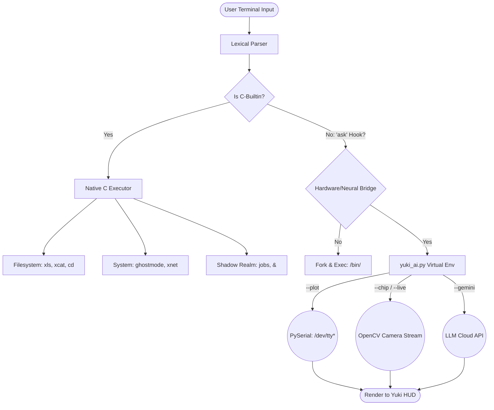

<div align="center">

```text
                    ..
                  .8888.
                 .888888.
                .88888888.
               .8888888888.
              .888888888888.
             .88888888888888.
            .888888P"  "Y888888.
           .88888P'      `Y88888.
          .88888P          Y88888.
         .88888P            Y88888.
        .88888P    .8888.    Y88888.
       .88888P    .888888.    Y88888.
      .88888P    .88888888.    Y88888.
     .88888P    .8888888888.    Y88888.
    .88888P    .888888888888.    Y88888.
   .88888P    .88888888888888.    Y88888.
```

# YukiShell | Aegis-Edge Core (V26c)


**YukiShell** is a high-performance, custom C-based Linux shell environment engineered specifically for Electronics and Communication Engineering (ECE) workflows, embedded systems development, and hardware-accelerated terminal operations.

Developed by **Yukino Labs**, it bridges the gap between low-level system execution, bare-metal hardware telemetry, and integrated neural workflows natively within the terminal.

</div>

---

## 📸 System Interface

### Integrated LLM & Environment Fetch
*Real-time querying and system hardware diagnostics.*


### Ghostmode (Ephemeral Namespace)
*Root-level system override initiating an isolated, RAM-only `/tmp` container environment.*


*(Note: Ensure the screenshots above are placed in the root directory of your repository with the exact filenames to render correctly).*

---

## ⚙️ Core Features & Command Manifest

YukiShell is packed with native C-builtins and extended Python hardware hooks to streamline complex engineering tasks.

### 📁 Filesystem & Core
* **`xls`** — Enhanced directory lister featuring rich metadata, sizing, and custom color-coded outputs.
* **`xcat <file>`** — Secure file stream with custom formatting headers, replacing standard `cat`.
* **`cd <path>`** — Robust directory traversal supporting relative paths, `..`, and `~` expansion.
* **`clear`** — Wipes the terminal buffer and re-renders the YukiShell HUD cleanly.
* **`neofetch`** — Instantly displays the Yuki ASCII logo, system resource usage, and live hardware specifications.

### 🛡️ System & Network (Sentinel)
* **`ghostmode`** — Drops the user into an ephemeral, isolated namespace container. All files written inside exist only in RAM and vanish entirely upon exit.
* **`jobs`** — Monitors all background process IDs operating in the "Shadow Realm".
* **`xnet [host]`** — Lightning-fast asynchronous port scanner (100ms timeout per port) for local network auditing.
* **`dash`** — Launches a real-time hardware telemetry dashboard for system oversight.
* **`<command> &`** — Appending `&` detaches any process to background execution seamlessly.

### 🧠 Neural Link & Vision (`ask` sub-engine)
* **`ask --gemini "prompt"`** — Directly queries the integrated LLM for ECE coding assistance, kernel debugging, or algorithmic logic.
* **`ask --plot <port>`** — **Yuki Oscilloscope:** Reads raw serial data (e.g., from `/dev/ttyUSB0` at 9600 baud) and renders a live ANSI-based waveform graph directly in the terminal.
* **`ask --chip`** — **Silicon Scanner:** Activates the webcam, utilizes computer vision to read laser-etched IC markings, and fetches datasheet summaries and ASCII pinout diagrams automatically.
* **`ask --live`** — **Visual Tutor:** Initiates a real-time continuous video stream analysis agent.
* **`ask --voice`** — Parses acoustic input into executable terminal commands or text queries.

---

## 🎯 Target Audience & Unique Value

**Who is this for?**
* **Embedded Software Engineers:** Professionals requiring instant, scriptable access to serial ports and I2C/SPI buses without leaving the command line.
* **ECE Students & Researchers:** Academics who need rapid access to IC datasheets, pinout visualization, and algorithmic assistance.
* **Linux Power Users:** Enthusiasts looking for a lightweight, highly customized shell capable of deploying ephemeral memory containers (`ghostmode`).

**What makes it unique?**
Unlike standard `bash` or `zsh`, YukiShell is domain-specific. It merges standard POSIX shell capabilities with bare-metal hardware analysis tools (like terminal oscilloscopes) and OpenCV-driven silicon scanning, creating an all-in-one workspace for hardware developers.

---

## 🆕 What's New in V26c
* **Aegis-Edge Core Architecture:** Fully modularized C source code (`builtins.c`, `parser.c`, `executor.c`) for superior memory management and linker efficiency.
* **Baud Rate Synchronization:** Hardened native 9600/115200 serial communication handling for zero-latency telemetry plotting.
* **Shadow Realm Expansion:** Improved PID tracking for background tasks and robust signal handling (SIGINT/Ctrl+C routing).

---

## 🏗️ System Architecture & Workflow

*The diagram below maps the execution flow of YukiShell. It supports panning and zooming in compatible markdown environments.*



---

## 🛠️ Installation & Setup

### Prerequisites
Ensure your Linux distribution has `gcc`, core build utilities, and Python 3 installed.
```bash
sudo apt update
sudo apt install build-essential libreadline-dev python3 python3-venv python3-pip
```

### 1. Clone the Repository
```bash
git clone [https://github.com/yourusername/Yukishell.git](https://github.com/yourusername/Yukishell.git)
cd Yukishell
```

### 2. Configure the Python Environment
The AI and Hardware components require specific dependencies.
```bash
python3 -m venv venv
source venv/bin/activate
pip install google-generativeai opencv-python pyserial
```

### 3. API Key Configuration
Create a `.env` file in the root directory to authorize the neural engine:
```env
GEMINI_API_KEY=your_api_key_here
```

### 4. Compile the Aegis-Edge Core
Build the C-binaries utilizing the included headers:
```bash
gcc src/*.c -Iinclude -o yukishell -lreadline
```

### 5. Launch YukiShell
```bash
./yukishell
```

---

## 🤝 Contribution Guidelines

YukiShell thrives on community input, specifically from developers in the hardware, embedded systems, and Linux kernel spaces. 

1. **Fork the Repository**
2. **Branch for Features:** `git checkout -b feature/NewHardwareHook`
3. **Commit cleanly:** `git commit -m 'Added native I2C bus scanning builtin'`
4. **Push to branch:** `git push origin feature/NewHardwareHook`
5. **Open a Pull Request:** Ensure your code passes all native `gcc` compilation checks without warnings.

**Development Standards:**
* Core shell execution, parsers, and filesystem commands must remain strictly in standard C inside the `src/` directory.
* External API calls and complex hardware libraries (OpenCV, PySerial) should be routed through the Python bridge to maintain C-core stability.
* Validate memory safety using `valgrind` before submitting a PR.

---

## 🔒 Security Policy

### Supported Versions
Only **V26c (Aegis-Edge)** and newer releases receive active vulnerability monitoring and patches. Legacy V16.0 branches are deprecated.

### Reporting Vulnerabilities
If you discover a vulnerability—such as a namespace escape vector in `ghostmode`, buffer overflows in the `xcat` parser, or unauthorized execution contexts—please **do not** open a public issue.

Submit a detailed report to the **Yukino Labs Security Team** via private email. Ensure your report includes:
* Steps to reproduce the exploit.
* OS environment (e.g., Ubuntu 25.10, VMware).
* Severity assessment (e.g., Privilege Escalation, Arbitrary Code Execution).

We commit to addressing and patching reported vulnerabilities prior to public disclosure.

---

## 📜 License

This project is distributed under the **MIT License**. See the `LICENSE` file for full details.

> **Designed and Developed by Aman Kumar** | ECE Core | Yukino Labs 